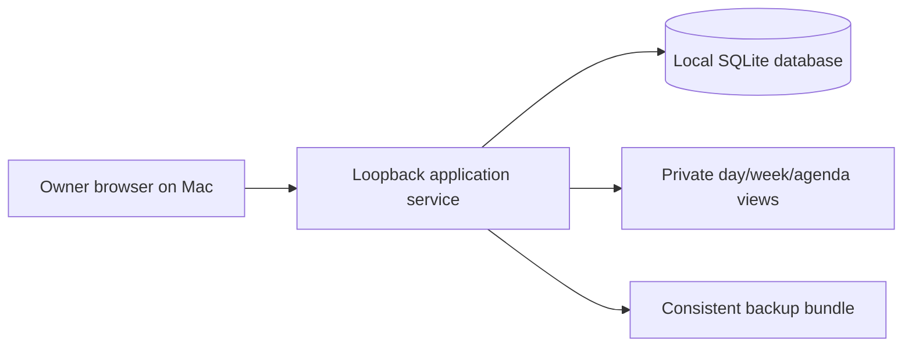

# Architecture and scaffolding proposal

## Accepted interaction architecture (2026-09-17)

The application remains one loopback Django service, but its owner-facing
composition is accepted as: Today; unified Schedule views (Day, Week, Agenda,
Recurring Times); Shows; History; and Settings. The schedule-item workbench is
the composition root for contextual plan/media/preparation/programming/upload/
airing/activity views. The Show workspace composes show, Producer, episode queue,
weekly times, premiere selection, and upcoming occurrences. Legacy endpoints may
redirect to their new contextual destinations during migration; this does not
create duplicate workflows.

The UI should derive statuses and one activity timeline from authoritative facts.
It must not create a second status store or duplicate event facts merely to make
the workbench convenient. Technical provenance, immutable IDs, and migration
values remain expandable history details rather than primary form fields.

The accepted ownership split is asset version for source/encoding, asset version
+ Device for transfer and library registration, Occurrence + Device for playback
programming, and exact Occurrence revision coverage for uploaded schedules.
Replays reuse asset preparation but never silently reuse occurrence programming or
upload coverage. Show-level slot length is materialized as an occurrence snapshot
when a plan is created or revised. Legacy fields are retained only for migration
and audit compatibility.

Status: accepted for implementation on 2026-09-09; the initial runtime/testing target is macOS 26.x on Apple Silicon. Unsigned local PyInstaller packaging is implemented and smoke-tested; signing, notarization, distribution, and Intel validation remain open/deferred. Updated 2026-09-09.

## Accepted UltraNEXUS automation boundary (updated 2026-10-02)

ChannelDex separates media preparation from schedule commitment with two
immutable approval snapshots. A supervised local worker owns encoding, media
inspection, FTP transfer, remote verification, and future scheduled publication.
Encoding, inspection, FTP, NMG, BIN compilation, and XPASS activation are
replaceable adapters. The restricted writer keeps target-specific NMG and BIN
bases separate; schedule delivery records a known-good local and remote backup
before one attended LOADSCH. The UI requires separate staging, promotion, and
activation-evidence actions. Target capabilities remain evidence-gated and fail
closed until destination qualification passes. The restricted compiler shares
one immutable mutation plan across the format-specific NMG and BIN writers, then
checks Thursday-epoch event identity, Switchbacks, adjacency, wrap behavior, and
intentional base gaps before publication. New resource references additionally
require the target's resource-registration gate; edits using existing references
do not inherit that unrelated blocker. Both formats retain exact byte-range
audits and are reparsed from their atomic temporary files before their immutable
artifact rows are committed. Identifier reservations occur transactionally
before transfer and remain permanent even when later work fails.
See [ULTRANEXUS_AUTOMATION.md](ULTRANEXUS_AUTOMATION.md).

## Recommended shape

Run one small application service on the owner's **Mac**, accessed through a browser on that same computer. Bind to loopback by default and keep the authoritative SQLite database/config on local Mac disk, outside SMB. Media source and encoded files use the confirmed LAN SMB home; the app stores references. The application service must be running while in use. Internet access is unnecessary for ordinary operation once installed; updates can be an explicit maintenance activity. Shared LAN access and public hosting are deferred.

Use **Python + Django 5.2 + SQLite**, with server-rendered HTML, local CSS, and modest JavaScript for calendar interaction. This stack was accepted on 2026-09-09 for the confirmed single-editor workload. Django supplies database models, migrations, templates, and administrative tools; the V1 scaffold uses a purpose-designed scheduling interface. [Django overview](https://docs.djangoproject.com/en/5.2/intro/overview/)

SQLite fits a single application host with a modest editing workload. Browser clients communicate with the service; they do not open the database file. Keep it on the host's local disk, outside synced folders and network shares. SQLite permits one writer at a time, so substantial concurrent writes would warrant reconsidering the database. A separate database service is deferred until measured needs justify it. [SQLite deployment guidance](https://www.sqlite.org/whentouse.html)

The tested dependency set is pinned in `requirements.lock`. The bundled-runtime macOS launcher is implemented through the reproducible unsigned PyInstaller build in `packaging/`. The initial target is macOS 26.x on Apple Silicon; Intel requires a later separate build and validation, and no universal executable is claimed. Signing, notarization, installation restrictions, and distribution form remain open/deferred. Source and export formats should remain portable to other hosts later. No container requirement is proposed.

A browser-only HTML file with browser storage would reduce installation work, but would complicate shared editing, reliable backups, and consistent history. It is not the recommended authoritative store for these requirements.

## Boundaries



Public access is deferred by the owner. Calendar export is out of the first release and is a near-term roadmap follow-up; format and public fields can be decided later. Private day/week/agenda views remain in the V1 scheduling workspace.

Proposed application boundaries:

| Area | Responsibility |
| --- | --- |
| Catalog | Shows and episodes with required minimum identification, optional synopsis/contact fields, ordered slate, prior air dates, standalone filler/ID/PSA assets, asset versions, and runtime that may be unknown |
| Scheduling | Full-day timelines, effective-dated weekly slots, cycle assignments, dated items, live events, gaps, conflicts and exceptions |
| Operations | Preparation checklist, target-device transfer status, per-airing programming confirmation |
| History | Evidence-backed airings, reconciliation, auditable corrections |
| Calendar | Personal scheduling workspace, week/day grid and agenda; export deferred to near-term roadmap |
| Administration | Station settings, owner audit context, backup and restore |
| Future imports | Vendor adapters feeding a common preview/validation process; not an initial module |

These are modules in one application, not separate services. PUB-TV is the initial active station. Station-scoped scheduling, target devices, and history must allow later GOV-TV activation without a second application. Sharing show or episode records across stations remains a later policy choice. A multi-user permissions system is not required for the personal first release.

## Storage and operational guarantees

- Store metadata, media management notes, and references to video files initially. All source availability, Adobe Media Encoder processing, FTP transfer, WinLGX library/schedule editing, and UltraNexus upload remain manual external work; the app records notes, references, owner, and timestamps only. Do not automate or assert technical validation. Live events can explicitly mark file preparation steps not applicable.
- The confirmed week starts Monday at 00:00 Eastern Time. Propose `America/Detroit` as the daylight-saving-aware IANA representation. Store recurrence as Eastern local wall-clock rules, never fixed UTC recurrence; a 5:00 show remains 5:00 year-round. Resolve occurrence instants in UTC with local rule context preserved. Sunday 01:00–03:00 is curated supplemental filler with no assigned producer slots; transition handling is not an owner-review blocker and requires no further dedicated planning. Bundle timezone data for consistent offline behavior. [Python timezone support](https://docs.python.org/3/library/zoneinfo.html)
- Apply edits and schedule generation transactionally. Use revision checks to reject stale edits. Validate overlaps inside the same write transaction, including cross-midnight intervals; adjacent slots may touch. Repeated generation must not duplicate airings.
- Give each scheduled item an immutable identity and retain planned revisions. Generated items also have a stable generation token independent of later episode/time edits. Regeneration matches existing tokens and previews changes; it cannot resurrect cancelled or superseded items. Rescheduling retains an explicit original/replacement relationship. Coverage calculations use only current effective items, while historical plans remain queryable.
- Account for the entire local broadcast day, including filler, IDs, PSAs, and planned live-event durations. Display all gaps and overlaps; never fabricate filler to make a day appear complete. A cross-midnight item has one identity and is clipped visually into day views. A DST transition day covers its full local day even when elapsed duration is 23 or 25 hours.
- Keep program starts fixed to their slots. Distinguish slot end, selected asset runtime, and expected content end; derive reserved virtual-channel filler after shorter content. Missing runtime leaves only the filler amount not determined, never available. Treat 60 seconds as a proposed advisory threshold, flag over-slot episodes, and perform no automatic shifting, trimming, filler insertion, or playout control.
- Use one owner-confirmed episode for each premiere-to-premiere cycle. The app suggests the next pending episode and next active premiere slot; if no new episode arrives, the owner can explicitly choose an older one. An off-by-default station setting is a standing owner authorization to create a visibly labeled, audited fallback cycle from the most recent explicit episode for an otherwise unassigned current/future week. Explicit episode and No program plans win, No program stops later carry-forward, disabling the setting affects only future generation, and the fallback never advances the pending queue. Replays after a premiere retain its episode until the next premiere, so a Monday replay before a Wednesday premiere belongs to the prior cycle rather than resetting at the calendar boundary. After a premiere passes with a recorded, valid uploaded schedule revision matching the premiere, an idempotent operational transition marks the episode previously scheduled and exposes the next pending item for planning. This never proves airing, silently confirms a suggestion, reorders or substitutes episodes, or consumes replay assignments. Future premieres and those lacking a valid exact match remain pending; cancelled or known failed premieres require owner review.
- Pin programming confirmation to the exact item, asset version if applicable, target and scheduled time. Changes invalidate affected readiness/confirmation while preserving audit history. Time passing, being fully prepared, and calendar export never count as evidence of an actual airing.
- Keep the app's desired schedule distinct from the manually edited/uploaded WinLGX schedule revision. The proposed `UploadedScheduleRevision` record has an immutable internal ID, optional operator-entered external label/reference, exactly one target device, operator/audit actor, upload timestamp, and an immutable explicit set of covered occurrence revision IDs. Its lifecycle is `active`, `superseded`, or `invalidated`; supersession links prior/newer records with reason, actor, and timestamp, while record-level invalidation voids all coverage and records reason, actor, and timestamp. The operator confirms the match and associates the external revision with covered occurrences; upload never proves airing.
- Keep six manual preparation stages separately recorded: source available; encoded with Adobe Media Encoder preset/version/machine/output; exact FTP transfer/device; WinLGX library registration; slot assignment; and schedule revision upload. Record owner, time, and references for each. Live events may mark file-based steps N/A, and configured-owner confirmations keep stages consistent. Readiness remains distinct and device-specific; upload never proves airing. An upload is an exact match only when its device matches, it is `active`, and its explicit coverage contains the exact effective occurrence revision ID. Missing, stale, superseded, invalidated, or predecessor-linked coverage fails. A newer upload must explicitly cover every occurrence revision it intends to certify; coverage is never inherited. An episode/asset version, start, duration, status, target, reschedule, cancellation, preemption, or other effective occurrence change leaves the historical upload intact but makes its prior occurrence-revision link stale for current readiness and queue transitions. These rules support the idempotent queue transition after a passed premiere, but never establish that it aired.
- Manual history records retain the owner's identity, asserted actual time/date precision, and source/note. Unknown times stay unknown. Corrections supersede prior claims. Import and schedule/file exchange with Leightronix are roadmap work only; samples are not required to build the manual first release.
- Present scheduled past/unverified, reported/observed with source attribution, log-verified actual, and discrepancy/correction states separately. UltraNexus logs are authoritative when manually checked; no routine verification, automatic matching, or import is required. Missing logs leave status unknown and do not block planning.
- Future calendar export can use an atomic sanitized snapshot of selected occurrence versions, a generated-at timestamp, and an export revision; this is roadmap design, not a V1 capability.
- Keep the authoritative database/config outside the source tree on local Mac disk in one clearly identified, configurable application data folder (macOS Application Support is proposed; do not assume the `.app` bundle contains runtime data). V1 backup is manual and local: fully quit the app/server, then copy the complete data folder plus schema/version manifest. A database-only copy may omit config/evidence and SQLite WAL/journal sidecars unless clean shutdown/checkpoint is confirmed. Media is on SMB and excluded; media retention is deferred, with no automatic expiry, deletion, purge, rotation, or remote copy.
- Encode machines may record both their mount-specific path and a stable SMB-relative location. Do not automatically move, rename, mount, reorganize, or delete media. App history records references and notes; it does not prove that SMB is online or that a referenced file still exists.
- Use the confirmed lowercase shared layout `PUB-TV/<Show-Code>/source/` and `PUB-TV/<Show-Code>/encoded/`, with no per-episode directories. The SMB root and naming/ID format remain open; do not impose a file convention or infer queue order from filenames.
- Restore into a separate empty local data folder and verify counts, known episode history, settings, and direct app access before replacing a live installation. Document the chosen data-folder path and restore steps before rollout; perform a restore rehearsal. A manual pre-upgrade copy is a proposed safe practice, not an automated schedule.

For the initial Mac installation, use loopback binding, host/origin validation, CSRF protection, protected runtime files, and a production application server. Open directly for the configured local owner with no separate login or password; do not build staff roles now. Any later LAN access needs authentication, authorization, and a reviewed network/TLS configuration. The development server is not the operational server. [Django deployment checklist](https://docs.djangoproject.com/en/5.2/howto/deployment/checklist/)

## Implemented V1 scaffold

```text
PUB-TV/
  AGENTS.md
  README.md
  docs/                  # Requirements, decisions, architecture, data model
  pyproject.toml
  pubtv/
    config/
    catalog/
    scheduling/
    operations/
    history/
    templates/
    static/              # Locally served assets; no runtime CDN
  tests/                 # Scheduling, history, readiness, privacy, browser journeys
  packaging/             # Reproducible unsigned macOS .app build
```

Names and exact module boundaries may be simplified at implementation. Runtime databases, real producer contacts, source exports, video, credentials, and backups must not enter source control. Use synthetic or owner-sanitized fixtures.

## Proposed delivery sequence

1. **Implement and verify the approved scaffold:** run the focused Django tests and review the local workflow with synthetic data. Real vendor files are optional context and remain outside V1.
2. **Prove the scheduling rules:** create the approved scaffold, a synthetic PUB-TV station, show episodes and standalone assets, recurrence and weekly assignments, full-day coverage, live events, gap/overlap handling, and history/time-boundary tests. Demonstrate a premiere with linked replays and a preemption.
3. **Make the daily workflow usable:** add producer records, next-on-slate visibility, preparation checklists, media notes, weekly/day/agenda views, manual history lookup, and audit behavior. Calendar export follows as a near-term roadmap item.
4. **Pilot and package:** the unsigned Apple Silicon macOS 26.x `.app` build is implemented in `packaging/`; validate the actual Mac, offline operation, stale edits from multiple tabs, privacy, backup/restore, and the owner's real full-day workflow before operational adoption. Intel requires a separate build and later validation.
5. **Later expansion:** consider Leightronix file/schedule exchange and historical imports, GOV-TV, TelVue integration, shared access, and public distribution as separately reviewed increments.

## Accepted usability delivery sequence (implemented and verified)

1. Build the navigation shell, Today, unified Schedule views, contextual actions,
   compatibility redirects, and return-to-context behavior.
2. Build the schedule-item workbench and derived readiness/activity presentation.
3. Build the Show workspace, canonical Producer/episode/queue/time-slot flows,
   and migration-only handling for redundant fields.
4. Reconcile data ownership and add migrations without deleting historical
   provenance; preserve all accepted separation rules.
5. Run focused tests, then pilot the complete daily workflow with synthetic and
   owner-sanitized data. Runtime usability and behavioral verification remain
   pending until those checks occur.

Future import acceptance must define source namespace plus stable row identity/fingerprint, duplicate file/row no-op behavior, and explicit conflict review when the same identity changes. Retain private originals, mappings, parser versions, and row provenance; commit accepted rows transactionally. Schedule files cannot establish actual airings. Do not promise a format or API before examining representative samples.

All phases after phase 1 are proposals. The project's test scope should follow affected behaviors; documentation changes require structural review, not application tests. Runtime-dependent promises need evidence from the pilot.
# Prepare & Deliver boundary

The station workflow keeps private source intake, preparation, schedule publication, attended activation, and independent observation as separate durable facts. The operator view is a server-rendered stepper over those facts; it does not imply that transfer or airing occurred merely because a batch was queued.

## Independent media and schedule workspaces

**Accepted:** intake creates immutable episode-linked approved batches; a singleton
worker processes them sequentially while web requests continue to plan premieres.
The launcher owns worker lifetime. Recovery surfaces interrupted items for review,
without replaying uncertain transfer or activation work. Browser polling reads
durable status and does not execute jobs. Bulk premiere planning and cycle-based
publication preparation use reviewed snapshots and transactional confirmation.
Media approval excludes planning metadata; publication approval includes exact
occurrence revisions, chosen media versions, and cycle/target provenance.
